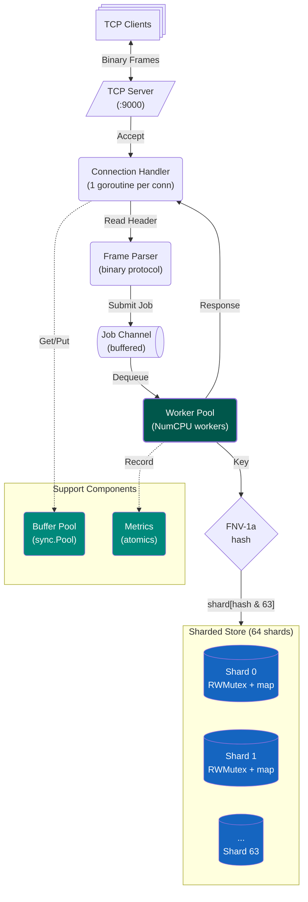

# ShardCache

A concurrent in-memory key-value cache server in Go. Built as a learning project.

---

## Why I Built This

I was exposed to Go heavily in the past year, but I found myself writing Go without really understanding what makes it Go. I didn't have a strong command of the Go primitives, and lacked the mental model to appreciate the concurrency strengths and abstractions Go presents. 

More broadly, concurrency was a gap in my CS knowledge. I'd learnt about mutexes and channels in OS class, but I'd never built something where the choice between a mutex and a channel actually mattered. I wanted to get my hands dirty with a few things:

- Fine-grained locking (and why 64)
- Memory pooling (why `sync.Pool` exists)
- Binary protocols for speed
- The tradeoffs that real systems like Redis and Memcached make

This definitely isn't a Redis replacement, because it currently lacks the distributed systems strengths. But is does give me a good understanding of why Redis made the choices it did. 

---

## Architecture



---

## Build and Run

```bash
# Start the server (listens on :9000, pprof on :6060)
go run ./cmd/server

# In another terminal, use the client
go run ./cmd/client set foo bar    # OK
go run ./cmd/client get foo        # Value: bar
go run ./cmd/client del foo        # OK
go run ./cmd/client get foo        # NOT FOUND
```

---

## Run Tests

```bash
go test ./...                      # All tests
go test -race ./...                # Race detector
go test -bench=. ./internal/store  # Benchmarks
```

Fuzz testing (let it run for 30+ seconds):

```bash
go test -fuzz=FuzzDecodeHeader -fuzztime=30s ./internal/protocol/
go test -fuzz=FuzzDecodePayload -fuzztime=30s ./internal/protocol/
go test -fuzz=FuzzRoundTrip -fuzztime=30s ./internal/protocol/
```

---

## Binary Protocol

```
┌───────────┬───────────┬───────────┬───────────┬───────────────────┐
│ Start (1B)│ OpCode(1B)│ KeyLen(2B)│ ValLen(4B)│ Payload (K+V)     │
└───────────┴───────────┴───────────┴───────────┴───────────────────┘
     0xCA      0x01-03      big-endian   big-endian   key || value
```

Request opcodes: GET (0x01), SET (0x02), DELETE (0x03)

Response opcodes: OK (0x80), ERROR (0x81), VALUE (0x82), NOT_FOUND (0x83)

---

## Benchmark Results

### 1. Local Benchmark (4 Cores)

On 4 physical execution units, a 64-shard store can only experience parallel contention across at most 4 shards at any given microsecond. The remaining 60 shards remain uncontended (aka just chilling). This bounds how much we can speed this up.

```text
BenchmarkComparison/Baseline/goroutines-1-4      21.19 ns/op
BenchmarkComparison/Sharded/goroutines-1-4       28.61 ns/op    (0.74x, hash/indexing overhead)

BenchmarkComparison/Baseline/goroutines-10-4    126.30 ns/op
BenchmarkComparison/Sharded/goroutines-10-4      20.43 ns/op    ~6.2x faster

BenchmarkComparison/Baseline/goroutines-64-4    137.50 ns/op
BenchmarkComparison/Sharded/goroutines-64-4      19.10 ns/op    ~7.2x faster (Local Peak)

BenchmarkComparison/Baseline/goroutines-128-4   131.00 ns/op
BenchmarkComparison/Sharded/goroutines-128-4      19.04 ns/op    ~6.9x faster

BenchmarkComparison/Baseline/goroutines-1000-4  132.70 ns/op
BenchmarkComparison/Sharded/goroutines-1000-4    23.06 ns/op    ~5.8x faster
```

**Local Ceiling:** Throughput tops out at **~7.2x** speedup. The baseline stabilises around ~130 ns/op, constrained by 4-thread core contention.

---

### 2. Cloud Scale-Out Benchmark (AWS Graviton ARM64, 64 Physical Cores)

Deployed to an AWS EC2 instance (64 dedicated physical vCPUs, unified on-die mesh interconnect) to evaluate whether sharded throughput scales linearly when physical core count matches shard count.

```text
BenchmarkComparison/Baseline/goroutines-1-64     56.33 ns/op
BenchmarkComparison/Sharded/goroutines-1-64      69.56 ns/op    (0.81x, hash/indexing overhead)

BenchmarkComparison/Baseline/goroutines-10-64   294.90 ns/op
BenchmarkComparison/Sharded/goroutines-10-64     28.16 ns/op    ~10.5x faster

BenchmarkComparison/Baseline/goroutines-64-64   326.40 ns/op
BenchmarkComparison/Sharded/goroutines-64-64     20.54 ns/op    ~15.9x faster

BenchmarkComparison/Baseline/goroutines-128-64  353.10 ns/op
BenchmarkComparison/Sharded/goroutines-128-64    20.87 ns/op    ~16.9x faster (Cloud Peak: ~17x)

BenchmarkComparison/Baseline/goroutines-1000-64 342.70 ns/op
BenchmarkComparison/Sharded/goroutines-1000-64   24.37 ns/op    ~14.1x faster
```

---

### 3. Scaling Comparison: 4 Cores vs. 64 Cores

| Goroutines | 4 Cores: Baseline | 4 Cores: Sharded | 4-Core Speedup | 64 Cores: Baseline | 64 Cores: Sharded | 64-Core Speedup |
| :--- | :--- | :--- | :--- | :--- | :--- | :--- |
| **1** | 21.19 ns/op | 28.61 ns/op | 0.74x | 56.33 ns/op | 69.56 ns/op | 0.81x |
| **10** | 126.30 ns/op | 20.43 ns/op | **6.18x** | 294.90 ns/op | 28.16 ns/op | **10.47x** |
| **64** | 137.50 ns/op | 19.10 ns/op | **7.20x** | 326.40 ns/op | 20.54 ns/op | **15.89x** |
| **128** | 131.00 ns/op | 19.04 ns/op | **6.88x** | 353.10 ns/op | 20.87 ns/op | **16.92x** |
| **1,000** | 132.70 ns/op | 23.06 ns/op | **5.75x** | 342.70 ns/op | 24.37 ns/op | **14.06x** |

---

### Some Architectural Takeaways

1. **Lock Contention Scales with Physical Bus Width:** On 4 cores, single-mutex baseline latency degrades to **~130 ns/op**. On 64 cores, the cache-invalidation traffic across the mech interconnect forces baseline latency up to **~353 ns/op**, a ~2.7x penalty on the mutex serial path alone.
2. **Horizontal Saturation Validates Sharding:** Despite Graviton's individual cores having ~2.4x slower single-thread execution latency than the Apple M1 Pro (69.56 ns vs 28.61 ns on 1 goroutine), 64 independent shards absorbed 64 concurrent hardware writers down to ~20 ns/op. Distributing lock contention across 64 partitions widened the relative speedup over the single-mutex baseline from 7.2x (local) to 16.9x (cloud).
3. **Cache Line False Sharing Prevention:** I incorporated a `[128]byte` padding buffer for each `shard` struct. This ensures adjacent shard mutexes do not reside on the same 64-byte/128-byte cache line granule, preventing cross-core invalidation storms between concurrent writer goroutines. Learnt this after realising my tests were bottlenecked.

---
<!--
## What I Learned

**TO DO**

---
-->
## File Structure

```
├── cmd/
│   ├── server/main.go          # Entry point, signal handling
│   └── client/main.go          # CLI client for testing
│
├── internal/
│   ├── protocol/
│   │   ├── opcodes.go          # Constants
│   │   ├── frame.go            # Encode/Decode
│   │   ├── frame_test.go       # Unit tests
│   │   └── fuzz_test.go        # Fuzz tests
│   │
│   ├── server/
│   │   ├── server.go           # TCP listener
│   │   ├── conn.go             # Connection handler
│   │   └── worker.go           # Worker pool
│   │
│   ├── store/
│   │   ├── shard.go            # Single shard (RWMutex + map)
│   │   ├── store.go            # 64-shard store with FNV-1a routing
│   │   ├── store_baseline.go   # Single-mutex baseline for benchmarks
│   │   ├── store_test.go       # Unit tests
│   │   └── store_bench_test.go # Benchmarks
│   │
│   ├── pool/
│   │   └── buffer.go           # sync.Pool for byte buffers
│   │
│   └── metrics/
│       └── metrics.go          # Atomic counters
│
├── go.mod
└── README.md
```

---

## What I'd Do Differently

I believe I got what I wanted out of this project. Now if I were building a production cache, I'd probably start single-threaded like Redis and only add threading for network I/O if profiling showed it was needed. Sharding the KV layer was good for learning, but the fact is that caching is more likely to be network and memory bound than CPU bound.

Also, I'd add TTL support. A cache without expiration is just a memory leak with extra steps lol.
